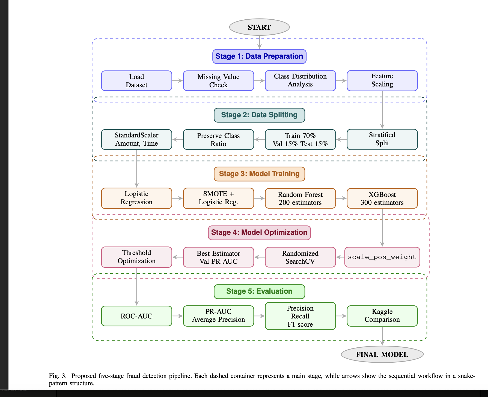
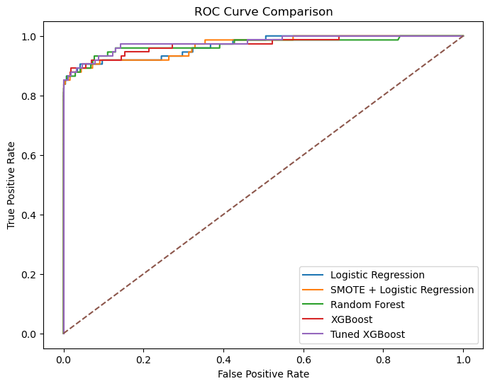
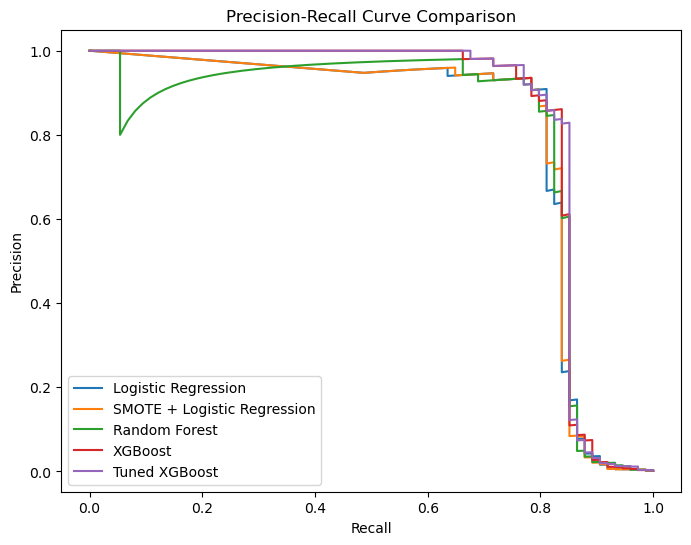
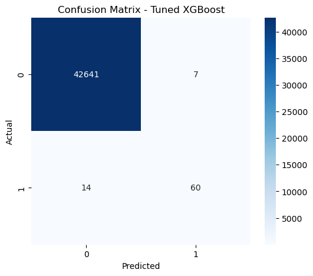
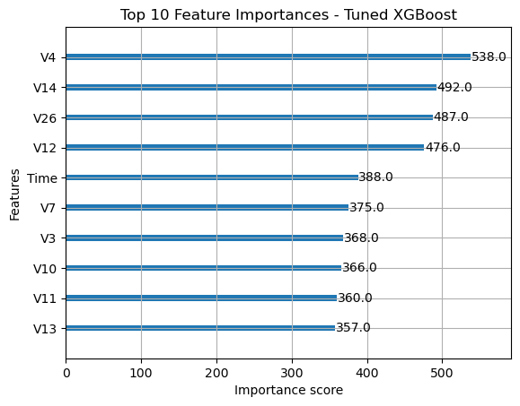

# Machine Learning-Based Credit Card Fraud Detection

A comparative machine learning project for detecting fraudulent credit card transactions using imbalance-aware learning strategies and threshold optimization.

---

## Project Overview

Credit card fraud detection is a highly imbalanced binary classification problem where fraudulent transactions represent less than 0.2% of all transactions.

This project evaluates multiple machine learning models and compares their performance using imbalance-sensitive evaluation metrics such as:

- PR-AUC
- Precision
- Recall
- F1-Score
- ROC-AUC

The project also applies:

- SMOTE oversampling
- Class weighting
- Threshold optimization
- Hyperparameter tuning

---

## Models Evaluated

| Model | Description |
|---|---|
| Logistic Regression | Baseline model with class balancing |
| SMOTE + Logistic Regression | Oversampling-based approach |
| Random Forest | Ensemble learning model |
| XGBoost | Gradient boosting model |
| Tuned XGBoost | Optimized final model |

---

## Dataset

European Credit Card Fraud Detection Dataset

- 284,807 transactions
- 492 fraud samples
- Severe class imbalance (~0.172%)

Features:
- V1-V28 (PCA transformed)
- Time
- Amount
- Class

> Dataset is not included in the repository due to file size limitations.

---

# Project Pipeline

The project follows a five-stage machine learning pipeline including preprocessing, stratified data splitting, model training, hyperparameter optimization, and evaluation.



---

## Project Pipeline Steps

1. Data preprocessing
2. Feature scaling
3. Stratified train/validation/test split
4. Model training
5. SMOTE oversampling
6. Hyperparameter tuning
7. Threshold optimization
8. Model evaluation

---

## Comparative Results

| Model | ROC-AUC | PR-AUC | Precision | Recall | F1-Score |
|---|---|---|---|---|---|
| Logistic Regression | 0.9680 | 0.7929 | 0.0671 | 0.8784 | 0.1248 |
| SMOTE + Logistic Regression | 0.9675 | 0.7935 | 0.0637 | 0.8784 | 0.1187 |
| Random Forest | 0.9703 | 0.8029 | 0.9194 | 0.7703 | 0.8382 |
| XGBoost | 0.9707 | 0.8400 | 0.8824 | 0.8108 | 0.8451 |
| Tuned XGBoost | 0.9773 | 0.8434 | 0.8955 | 0.8108 | 0.8511 |

---

# ROC Curve Comparison

Comparison of ROC curves across all evaluated machine learning models.



---

# Precision-Recall Curve Comparison

Precision-Recall curves provide a more reliable evaluation under severe class imbalance conditions.



---

# Confusion Matrix

Confusion matrix of the final tuned XGBoost model using the optimized threshold.



---

# Feature Importance

Top 10 most important features identified by the tuned XGBoost model.



---

## Kaggle Baseline Comparison

| Model | PR-AUC | Precision | Recall | F1-Score |
|---|---|---|---|---|
| Kaggle Baseline | 0.7500 | 0.1000 | 0.8600 | 0.1900 |
| Tuned XGBoost (Ours) | 0.8434 | 0.8955 | 0.8108 | 0.8511 |

---

## Repository Structure

```text
credit-card-fraud-detection-ml/
│
├── notebook/
│   └── fraud_project_final.ipynb
│
├── report/
│   └── IEEE_Report.pdf
│
├── data/
│
├── images/
│   ├── pipeline.png
│   ├── roc_curve_comparison.png
│   ├── pr_curve_comparison.png
│   ├── confusion_matrix.png
│   └── feature_importance.png
│
├── README.md
├── requirements.txt
└── .gitignore
```

---

## Installation

Clone the repository:

```bash
git clone https://github.com/burcukosedagi/credit-card-fraud-detection-ml.git
```

Install dependencies:

```bash
pip install -r requirements.txt
```

---

## Technologies Used

- Python
- Scikit-learn
- XGBoost
- Pandas
- NumPy
- Matplotlib
- Imbalanced-learn
- Jupyter Notebook

---

## Authors

- Burcu Kösedağı
- Dila Öykü Eyüboğlu

Department of Computer Engineering  
Istanbul Ticaret University

---

## Academic Report

The full IEEE-style report is available in:

```text
report/IEEE_Report.pdf
```